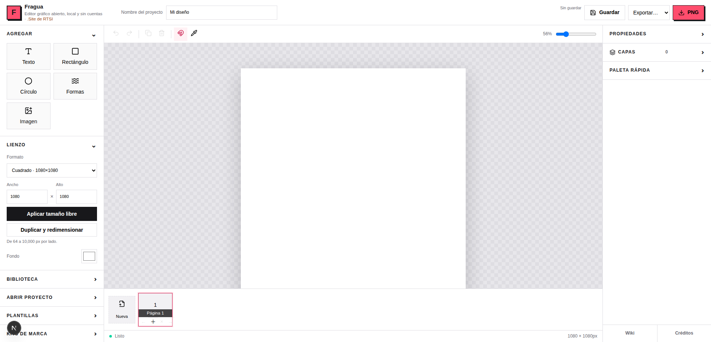

# Fragua

**Editor gráfico abierto, local y sin cuentas.**

Editor gráfico de carteles y composiciones, construido con Fabric.js y Next.js. Está pensado para ejecutarse en tu propio equipo: el lienzo se edita en el navegador y el servidor local guarda los proyectos y recursos en carpetas del repositorio.

La interfaz incluye documentos de varias páginas, texto y formas editables, imágenes, recorte, capas, agrupación, alineación, snapping, kits de marca, plantillas, una biblioteca de fotos e iconos y generación de formas SVG con ShapeSoup. Permite exportar PNG, JPEG, SVG, PDF y ZIP.

<p align="center">
  
</p>

## Requisitos

- Node.js compatible con Next.js 15 (se recomienda Node.js 20 o posterior).
- npm.
- Una clave de API de Pexels es opcional y solo se necesita para buscar fotografías en esa biblioteca.

## Ejecutar localmente

```bash
npm install
cp .env.example .env.local
```

Si quieres habilitar la búsqueda de fotos, agrega tu clave a `.env.local`:

```dotenv
PEXELS_API_KEY=tu_clave_de_pexels
```

Después inicia el servidor de desarrollo:

```bash
npm run dev
```

Abre [http://localhost:3000](http://localhost:3000). Para detenerlo, usa `Ctrl+C` en la terminal donde está corriendo.

Los otros comandos disponibles son `npm run lint`, `npx tsc --noEmit` y `npm run build`. Para el flujo normal de edición local no hace falta ejecutar el build.

## Guardados y archivos

Los datos se escriben en `data/` en el equipo donde corre el servidor:

| Carpeta | Contenido |
| --- | --- |
| `data/projects/` | Documentos editables en JSON y versiones anteriores de los proyectos. |
| `data/assets/` | Imágenes importadas y recursos descargados para incorporarlos al lienzo. |
| `data/exports/` | Exportaciones rasterizadas que el editor guarda localmente. |
| `data/templates/` | Plantillas guardadas. |
| `data/brands/` | Kits de marca. |

El botón **Guardar** y `Ctrl+S` guardan el proyecto; los proyectos ya existentes también tienen guardado periódico. Cambiar el nombre de un proyecto guardado crea una copia nueva. Las carpetas de datos se excluyen de Git para evitar subir diseños, imágenes o exportaciones personales por accidente. Haz copias de seguridad de `data/` si quieres conservar tus trabajos; Git no es su respaldo.

Aunque el lienzo se edita en el navegador, el guardado y la gestión de archivos dependen de rutas de servidor de Next.js. Por eso esta versión no es una aplicación puramente estática ni almacena todo solo en el navegador. Si despliegas una instancia con backend, ese servidor recibe y guarda los archivos.

## Recursos de terceros

- **Pexels:** búsqueda de fotografías; requiere `PEXELS_API_KEY`.
- **Iconify:** búsqueda e inserción de iconos.
- **Google Fonts:** carga de tipografías web cuando se solicita desde el editor.
- **ShapeSoup:** generación de formas y patrones SVG.

Cada recurso puede tener sus propios términos, atribución o licencia. Revisa los avisos y enlaces de la página [Créditos y avisos](/legal) y las condiciones del proveedor antes de publicar diseños que los incluyan.

## Wiki

La guía de uso está disponible en la ruta `/wiki` al iniciar la aplicación. Incluye los gestos básicos, atajos, organización de páginas, guardado y exportación.

## Proyecto y contribuciones

La aplicación muestra una atribución discreta a **.Site de RTSI**, proyecto web de **RTSI.mx**. La estructura y el editor se pueden explorar y ejecutar localmente.

Este repositorio todavía no declara una licencia propia. Las licencias de las dependencias no determinan los permisos sobre el código de Fragua; antes de invitar a reutilizarlo o distribuir forks, el mantenedor debe elegir y añadir una licencia raíz. La página [Créditos y avisos](/legal) resume las dependencias y servicios utilizados.

## Autoría y agradecimientos

<p align="center">
  <a href="https://github.com/ferkinzz">
    
  </a>
</p>

<p align="center">
  
  
</p>

<p align="center">
  <a href="https://github.com/ferkinzz">Fernando Rojas · ferkinzz</a> ·
  <a href="https://rtsi.site">.Site de RTSI</a> ·
  <a href="https://rtsi.mx">RTSI.mx</a>
</p>

El flujo de exploración y planeación también se apoyó en la colección personal de [skills de ferkinzz](https://github.com/ferkinzz/skills), en particular [reuse-finder](https://github.com/ferkinzz/skills/tree/main/skills/engineering/reuse-finder) para localizar antecedentes reutilizables y [platicador-de-proyecto](https://github.com/ferkinzz/skills/tree/main/skills/planeacion/platicador-de-proyecto) para ordenar decisiones del producto. Son herramientas auxiliares del proceso; no forman parte de las dependencias necesarias para ejecutar el editor.

## Tecnología

- Next.js 15, React 19 y TypeScript
- Fabric.js 7
- ShapeSoup, Lucide, jsPDF y JSZip
